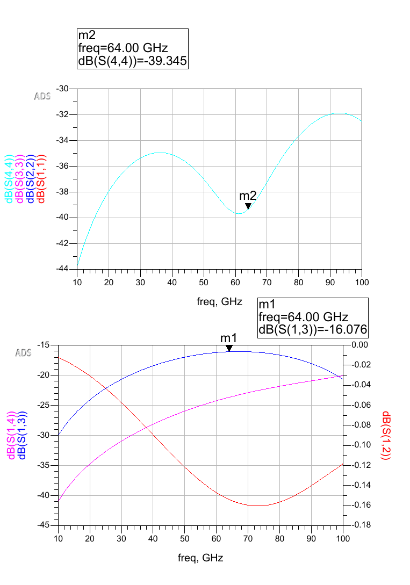
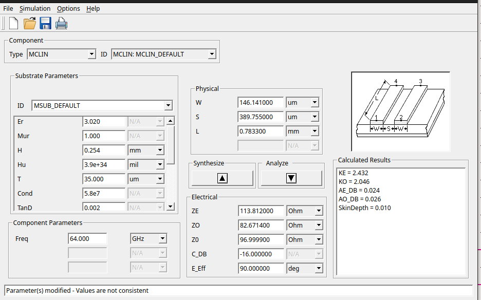

# EE4C05 Electromagnetics: 64 GHz Edge-Coupled Line Coupler

RF-track assignment for EE4C05 at TU Delft (with Yaonan Hu): design and simulation of a 97 Ω, 16 dB edge-coupled microstrip line coupler at 64 GHz, using ADS LineCalc for synthesis and ADS Momentum for full-wave EM verification. The deliverable is a conference-style poster, [EM_Coupled_Line_Coupler_Poster.pdf](EM_Coupled_Line_Coupler_Poster.pdf).

## What was done

- Chose the Rogers 3200 substrate (εᵣ = 3.02, tan δ = 0.002, 5.8×10⁷ S/m copper) for low loss and good manufacturability at mm-wave.
- Synthesized the coupled-line dimensions with ADS LineCalc for 16 dB coupling and 90° phase, giving W = 146.1 μm, S = 389.8 μm, L = 0.783 mm, with even/odd-mode impedances Z₀ₑ = 113.9 Ω and Z₀ₒ = 82.7 Ω.
- Simulated the ideal schematic, then compared lumped-element against transmission-line matching on the Smith chart.
- Ran ADS Momentum EM simulation on the extended layout, and used the ADS optimizer to tune the matching-line lengths to close the gap between schematic and EM results.

## Results

At 64 GHz the design reaches the 16 dB coupling target (S₁₃ ≈ -16.1 dB) with strong matching (S₁₁ ≈ -39 dB) and low insertion loss (S₁₂ ≈ -0.03 dB).

The overall Rogers 3200 implementation with integrated L-match networks achieves low loss, good isolation, and proper 50 Ω matching at 64 GHz in a compact footprint.

## Repository contents

| Path | Contents |
| --- | --- |
| `EM_Coupled_Line_Coupler_Poster.pdf` | Final poster with design flow, figures, and results |
| `coupled-line-coupler_lib/` | ADS workspace: schematics, layouts, Momentum EM data, substrate definitions |
| `report_data/` | Synthesis and result figures, assignment brief, transmission-line reference |
| `SubstrateData.lcs`, `*.subst` | Substrate and stack-up definitions (Rogers 3200, fused silica) |

Tools: Keysight ADS (LineCalc, schematic, Momentum EM), Rogers 3200 substrate models.
